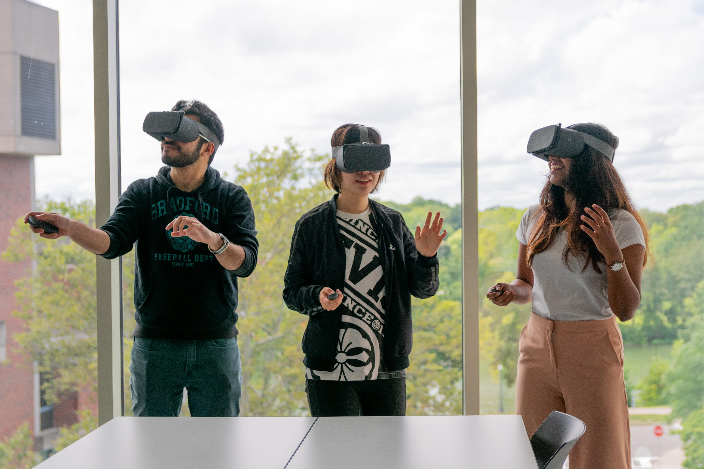
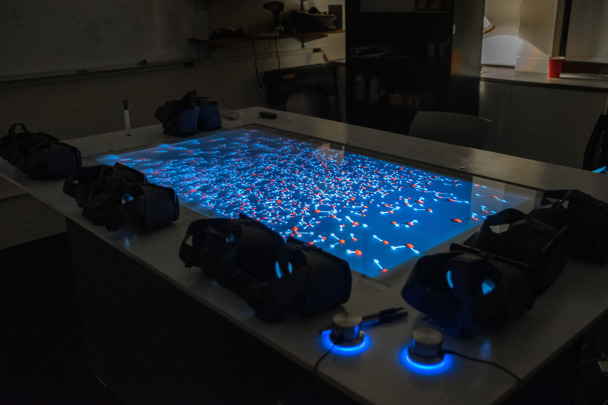

# SimView

SimView allows 3D visualization of molecular simulations from HOOMD-blue in Unity. The Unity scenes can be built for virtual reality (VR) or augmented reality (AR) as an android app. AR/VR, when used with simulations, provides a perception of depth that may improve understanding of inherently 3D concepts like dihedral angles, chirality, crystal structures, etc.

  

## Installation

### Bluehive installation

If working on BlueHive, you will need to load some modules before beginning the installation.

``` bash
module load git anaconda3/2018.12b cmake sqlite cudnn/9.0-7/ zmq/4.2.0/b1
```

Once modules are loaded, continue with the steps in Compiling with HOOMD-blue.

### Compiling with HOOMD-blue

Clone the required repositories and install dependencies.

``` bash
conda create -n hoomd-zmq python=3.7
source activate hoomd-zmq
export CMAKE_PREFIX_PATH=/path/to/environment
git clone --recursive https://bitbucket.org/glotzer/hoomd-blue hoomd-blue
cd hoomd-blue && git checkout tags/v2.5.2
conda install -c conda-forge rdkit
git clone https://github.com/ur-whitelab/simview
```

Then continue with the compilation.

```bash
ln -s $HOME/hoomd-zmq/hzmq $HOME/hoomd-blue/hoomd
mkdir build && cd build
CXX=g++ CC=gcc cmake .. -DCMAKE_BUILD_TYPE=Release \
 -DENABLE_CUDA=ON -DENABLE_MPI=OFF\
 -DBUILD_HPMC=off -DBUILD_CGCMM=off -DBUILD_MD=on\
 -DBUILD_METAL=off -DBUILD_TESTING=off -DBUILD_DEPRECATED=off -DBUILD_MPCD=OFF \
 -DCMAKE_INSTALL_PREFIX=`python -c "import site; print(site.getsitepackages()[0])"`
make
make install
```

If you are using a **conda environment**, you may need to force cmake to find your python environment. This is rare, we only see it on our compute cluster which has multiple conflicting versions of python and conda. The following additional flags can help with this:

```bash
export CMAKE_PREFIX_PATH=/path/to/environment
CXX=g++ CC=gcc cmake .. \
-DPYTHON_INCLUDE_DIR=$(python -c "from distutils.sysconfig import get_python_inc; print(get_python_inc())") \
-DPYTHON_LIBRARY=$(python -c "import distutils.sysconfig as sysconfig; print(sysconfig.get_config_var('LIBDIR'))") \
-DPYTHON_EXECUTABLE=$(which python) \
-DCMAKE_BUILD_TYPE=Release -DENABLE_CUDA=ON -DENABLE_MPI=OFF -DBUILD_HPMC=off -DBUILD_CGCMM=off -DBUILD_MD=on \
-DBUILD_METAL=off -DBUILD_TESTING=off -DBUILD_DEPRECATED=off -DSINGLE_PRECISION=ON -DBUILD_MPCD=OFF \
-DCMAKE_INSTALL_PREFIX=`python -c "import site; print(site.getsitepackages()[0])"`
```

### Running Unity Scene

1. broker.py is the broker. Run this on a machine with open ports and a static ip address.
	* Run command:

		```bash
		python simview/broker.py  A,B,C  4000,4001,4002
		```

		or use the entry point as:

		```bash
		broker  A,B,C  4000,4001,4002
		```

		if you want three clients (AR/VR devices to visualize simulations). The number of ports provided must match the number of simulations asked for, three in this example.

2. For live simulations:
	* ssh tunnel from Bluehive to the machine where the broker is running:
	
		```bash
		ssh -L 8080:localhost:8080 YourNetIDHere@bluehive.circ.rochester.edu
		```
	
		where 8080 should be replaced by the port that the broker is expecting and the port on which you instantiated the simulation on BlueHive.
	
	* ssh into your interactive node using
	
		```bash
		ssh -4 -L 8080:localhost:8080 your_node
		``` 
	
		and start a simulation wth the commands below.

	* To launch a simulation, run the `smile_sim.py` script.
	    
		```bash
	    python simview/smiles_sim.py --smiles_string [string] --density [integer] --socket ["tcp://*:XXXX"]
	    ```
	    
		You can also use the entry point to launch a simulation:
		
		```bash
		smiles_sim --smiles_string [string] --socket ["tcp://*:xxxx"] --period [integer] --particle_number [integer] --steps [integer] --density [float] --temperature [float] --pressure [float]
		```

3. For the client-side the only thing to make sure of is that the device is pointed at the correct ip address, namely the ip address for the machine where the broker is running. Currently this needs to be set in Unity in the BROKER_IP_ADDRESS variable for the FilterCommClient.cs (TODO: add support for changing the ip address in the client app itself).
